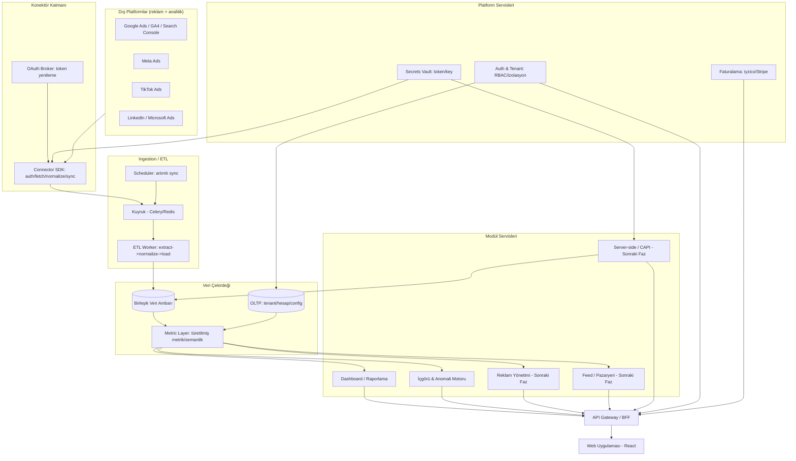

# AYAZ — Mimari Brifingi

> Hazırlayan: Çözüm Mimarı ajanı · 2026-06-26 · Çok kiracılı (multi-tenant) tek platform.
> İlke: **konektörler + birleşik veri modeli bir kez inşa edilir; tüm modüller aynı temizlenmiş veriyi tüketir.**

## 1. Sistem Mimarisi



- **Konektör Katmanı:** Tek tip `Connector` sözleşmesini uygulayan eklentiler. OAuth Broker token saklama/yenilemeyi merkezden yönetir; sırlar Vault'tan okunur, loglara asla yazılmaz.
- **Ingestion/ETL:** Scheduler her bağlı hesap için artımlı sync job'ı kuyruğa atar; Worker'lar extract→normalize→load. Kuyruk rate-limit ve retry'ı izole eder.
- **Veri Çekirdeği:** OLTP (tenant/config) ve Birleşik Veri Ambarı (zaman serisi fact) ayrı. Metric Layer türetilmiş metrik (CPA/ROAS/CTR) ve semantik tanımları tek yerden üretir — tüm modüller aynı tanımı kullanır.
- **Modül Servisleri:** Dashboard + İçgörü MVP'de; Reklam/Feed/CAPI sonraki fazlar. Hepsi yalnızca Metric Layer/DWH okur, kaynak API'lerine dokunmaz.
- **Platform Servisleri:** Auth&Tenant (org izolasyonu, RBAC), Secrets Vault (kron mücevher: müşteri token'ları), Faturalama (iyzico/Stripe).

## 2. Konektör Çatısı (Connector Framework)

Hedef: yeni platform eklemeyi "birkaç gün"e indirmek. Connector arabirimi:

| Yöntem | Sorumluluk |
|---|---|
| `authenticate()` | OAuth/API-key akışı; token'ı Vault'a yazar |
| `refresh_token()` | Süresi dolan token yenileme |
| `discover()` | Bağlı hesaptaki varlıkları listeler |
| `fetch(stream, since, until)` | Stream'i tarih aralığıyla çeker |
| `normalize(raw) -> UnifiedRecord` | Kaynak şemasını birleşik modele eşler; currency/timezone normalize |
| `incremental_state()` | Son başarılı sync watermark'ı |
| `capabilities()` | Stream'ler, write desteği, granülarite, rate-limit profili |

**Çapraz kesen altyapı (her konektörde ücretsiz):** Vault'ta şifreli token + proaktif yenileme; hesap başına sync cadence + watermark tabanlı artımlı çekim + ayrı backfill; per-konektör token-bucket + backoff + per-tenant fairness; geçici/kalıcı hata ayrımı + dead-letter + UI'da sync sağlığı; fixtures golden-file testleri.

**İlk konektörler (öncelik — reklam/analitik platformları):** 1) Google Ads 2) Meta Ads 3) GA4 4) Search Console 5) TikTok Ads 6) LinkedIn Ads 7) Microsoft/Bing Ads 8) Criteo 9) Pinterest Ads 10) Meta CAPI (Faz 4). **MVP dilimi:** 1-5. (Sonraki dalga talebe göre 6-9.)

## 3. Birleşik Veri Modeli

Star schema + zaman serisi fact tabloları. Para birimi tenant raporlama para birimine, zaman UTC'ye normalize.

```
tenant(org): id, name, country, base_currency, kvkk_region
connected_account: id, tenant_id, platform, external_account_id, vault_secret_ref, sync_status, watermark
dim_channel / dim_campaign / dim_adset / dim_ad / dim_date / dim_currency_rate

fact_daily_metrics:
  tenant_id, connected_account_id, channel_id, campaign_id, adset_id, ad_id, date_key
  impressions, clicks, cost_raw, cost_ccy, conversions, conversion_value_raw, conversion_value_ccy
  cost_base_ccy, conv_value_base_ccy   (normalize)
  -- türetilmişler (CTR/CPC/CPA/ROAS) Metric Layer'da tanımlanır, fact'te materyalize EDİLMEZ
```

Her konektörün `normalize()`'ı kaynağa özgü alanları (`spend`/`cost_micros`/`harcama`) tek kanonik alana çevirir. Tam kampanya hiyerarşisi olmayan kaynaklar (ör. GA4 organik trafik, Search Console) ilgili dim'lerde null-dim ("(not set)") satırına bağlanır. Tek geniş fact + ortak dim → kanallar arası blending (`GROUP BY date, channel`) trivial.

## 4. Yap-vs-Entegre Matrisi

| Yetenek | Karar | Gerekçe |
|---|---|---|
| Konektörler | Kademeli Yap | Sistemin temeli, dışa bağımlı olamaz; ilk 15 sonra genişle |
| Veri Hub (DWH+Metric Layer) | Sıfırdan Yap | Kron çekirdek; birleşik temiz veri = tüm değerin kaynağı |
| Dashboard/Raporlama | Sıfırdan Yap | Alt-küme (zorluk 2-3); Looker bağımlılığı "tek panel"i bozar |
| Otomatik İçgörü/Uyarı | Sıfırdan Yap | Ana farklılaştırıcı; kural+anomali+LLM-özet |
| Server-side/CAPI | Sonraki Faz → Yap | Altyapı, KVKK consent/dedup; MVP sonrası |
| Reklam Yönetimi/Optimizasyon | Sonraki Faz (Kademeli) | Write-API + MMM zoru (5); önce read |
| Feed/Creative Otomasyonu | Opsiyonel ileri faz | E-ticaret talebine bağlı feed→PPC/creative; pazaryeri satış kapsam dışı |
| LLM (NL özet/asistan) | **Entegre Et** | Model eğitmek pratik değil; Anthropic Claude API |
| Döviz kurları | Entegre Et | TCMB/ECB/ücretli API |
| Faturalama | Entegre Et | iyzico (TR) + Stripe (global); PCI nedeniyle asla kendimiz |

## 5. Teknoloji Yığını

İlke: sıkıcı, kanıtlanmış, TR'de işe alınabilir.

| Katman | Seçim | Gerekçe |
|---|---|---|
| Backend | **Python (FastAPI)** | Veri/ETL/ML ağırlıklı; tipli, hızlı; TR'de bol yetenek |
| Frontend | **React+TypeScript (Next.js)** | Geniş yetenek havuzu; SSR ile embed/paylaşılabilir rapor |
| OLTP | **PostgreSQL** | Sağlam, JSONB, RLS ile multi-tenant |
| Veri Ambarı | **Postgres+columnar → büyürse ClickHouse** | Tek DB ile başla, analitik yük artınca taşı |
| Kuyruk/Job | **Celery + Redis** | Olgun, yaygın; per-queue rate-limit |
| Cache | **Redis** | Dashboard cache + rate-limit + session |
| Secrets Vault | **HashiCorp Vault** | Token'lar için envelope encryption, audit, rotation |
| Auth | Kendi auth + RBAC (Keycloak ops.) | Multi-tenant model kontrolde; KVKK |
| Ödeme | **iyzico (TR) + Stripe (global)** | TR için iyzico zorunlu |
| Cloud | **K8s/managed container, TR/EU bölge** | KVKK veri ikametgahı |
| IaC | **Terraform** | Standart, taşınabilir |
| Observability | **Prometheus+Grafana+OTel+Sentry** | Sync sağlığı, kuyruk derinliği, hata |
| LLM | **Anthropic Claude API** | İçgörü NL özet/asistan; entegrasyon |
| Object storage | S3-uyumlu | Rapor PDF, fixtures, export |

## 6. Fazlı Teknik Yol Haritası

- **Faz 0 — Temel iskelet:** multi-tenant auth+RBAC, OLTP şeması, Vault, Connector SDK + fixtures harness, kuyruk/scheduler, OAuth Broker, faturalama kancası.
- **Faz 1 — MVP veri+dashboard:** ilk 5-7 konektör → artımlı sync → fact+dim → Metric Layer → kendi dashboard/raporlama, ₺/TZ normalizasyonu. *(Tek panel vaadi.)*
- **Faz 2 — Farklılaştırıcı içgörü:** kural motoru + anomali tespiti + LLM(Claude) NL özet + e-posta/Slack uyarı + scheduled PDF/paylaşılabilir rapor.
- **Faz 3 — Konektör genişleme + ajans/white-label:** LinkedIn, Microsoft/Bing, Criteo, Pinterest; çoklu müşteri/white-label rapor.
- **Faz 4 — Server-side/CAPI:** Meta CAPI + TikTok Events + Google + identity matching/dedup + KVKK consent.
- **Faz 5 — Reklam yazma/optimizasyon:** write-API kampanya yönetimi (önce Google/Meta), kural optimizer → forecasting/MMM.
- **Faz 6 — Mobil uygulama.**
- **Opsiyonel — Feed/Creative otomasyonu (Channable-tarzı):** yalnızca e-ticaret talebi olursa; pazaryeri satış kapsam dışı.

> Not: Stratejist, otomatik içgörüyü (Faz 2) **kamanın parçası** sayar → ilk satılabilir sürüm = Faz 1 + Faz 2 birlikte.

## 7. En Büyük Mimari & Güvenlik Riskleri

| Risk | Azaltma |
|---|---|
| **OAuth token kasası (kron mücevher)** — sızıntı = tüm müşteri reklam hesapları | Yalnızca Vault'ta envelope encryption; runtime decrypt; log/DB'ye düz YOK; least privilege; audit; rotation; toplu revoke |
| Vendor API limit/quota | Per-tenant token-bucket + backoff + fairness; adaptif cadence; sadece resmî API (scraping yok) |
| Vendor ToS | Yalnızca resmî/yetkili akış; politika uyumu; ToS izleme |
| Veri-sync tutarlılığı | Watermark + idempotent upsert; look-back penceresi (son 7-30 gün re-sync); freshness kontrolü; UI'da "son güncelleme" |
| Multi-tenant izolasyon | Postgres RLS + her sorguda `tenant_id`; tenant context middleware; izolasyon testleri; tenant bazlı Vault path |
| KVKK veri ikametgahı | TR/EU barındırma; veri minimizasyonu; CAPI consent; saklama/silme politikası; alt-işleyici sözleşmesi |
| Konektör bakım yükü | Fixtures regression; capabilities versioning; sağlık alarmı; per-konektör izole hata |
| Metrik tanım tutarsızlığı | Tek Metric Layer'da merkezi tanım |

**Can damarı:** Connector SDK + birleşik fact modeli + Vault tabanlı token koruması.
